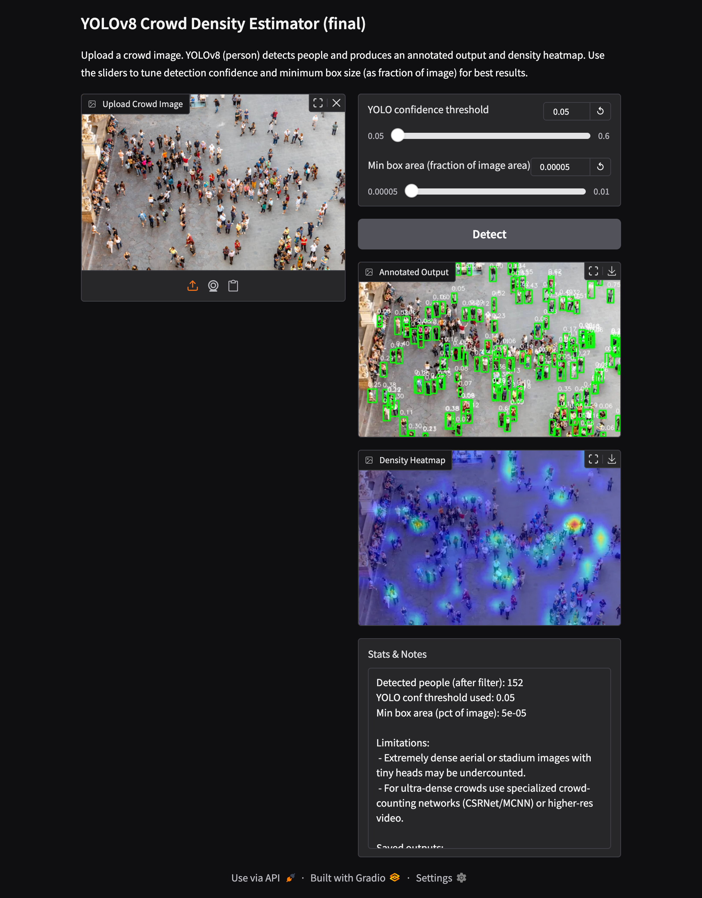

Crowd Density Detection Using YOLOv8

This project is designed to automatically detect and count the number of people present in an image. It uses the YOLOv8 object detection model to identify persons and provide an estimated crowd density. The system includes a simple graphical user interface built using Gradio, allowing the user to upload an image and view the results without requiring any technical knowledge.

The output generated by the system includes an annotated image showing detected persons with bounding boxes and the total number of people detected. A sample output screenshot from the interface is shown below.

The main objective of this project is to offer a fast and accurate method for crowd analysis using modern computer vision techniques. Manual crowd counting is often slow, unreliable and inefficient, especially in busy environments. This automated system provides a practical alternative suitable for academic demonstrations and introductory machine learning applications.

The working process of the system is simple. The user uploads an image through the interface. The image is then processed by the YOLOv8 model to identify all persons present. Each detection is marked on the image and the total count is calculated. The results are finally displayed back to the user in the Gradio interface.

The project is organized into key components such as the main detection script, the Gradio user interface script, the YOLOv8 model file, a sample input image and the final output screenshot. A requirements file is included to install all necessary dependencies.

To run the project, the user must install the required Python packages using the command “pip install -r requirements.txt”. After installation, the interface can be launched by running “python gradio_yolo.py”. This opens a local link in the browser where the image can be uploaded and results can be viewed.

This project uses technologies such as Python, YOLOv8, OpenCV, NumPy, Matplotlib and Gradio. These tools work together to perform detection, image processing and interface generation.

Possible future improvements include adding support for real-time video crowd analysis, enhancing density heatmap generation, deploying the project on cloud platforms, or adding tracking of individual persons.

Overall, this work demonstrates the use of modern object detection techniques for practical crowd density estimation. It provides a clean, simple and effective solution that can be used for learning, experimentation or academic submission.

